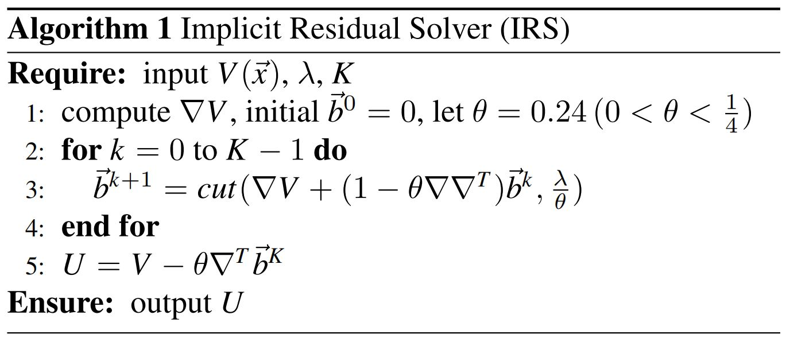
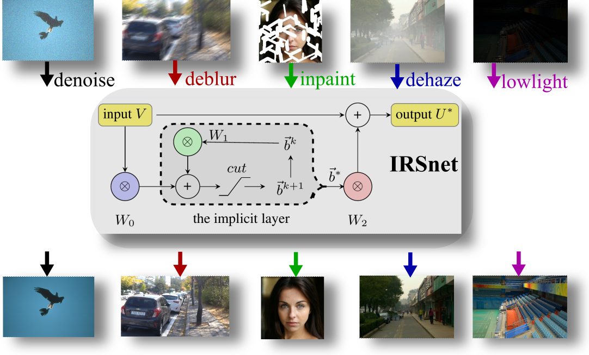

# [Paper](https://ieeexplore.ieee.org/document/10838572),  $~~~~$ [Code](irs.m)
## Implicit Residual Solver (IRS) for Total Variation Models

IRS only update one variable during the iteration loop. Thus, it is memory efficient and computationally fast.
## IRSnet: the unfolding neural network from IRS

Unfolding the Implicit Residual Solver as Neural Network with only 0.003M Parameters for Total Variation Models
```text
@ARTICLE{irsnet,
  author={Gong, Yuanhao},
  journal={IEEE Access}, 
  title={IRSnet: An Implicit Residual Solver and Its Unfolding Neural Network
  With 0.003M Parameters for Total Variation Models}, 
  year={2025},
  volume={13},
  number={},
  pages={10289-10298},
  doi={10.1109/ACCESS.2025.3528637}}
```
